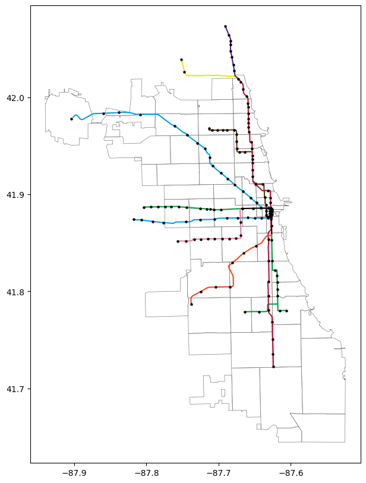
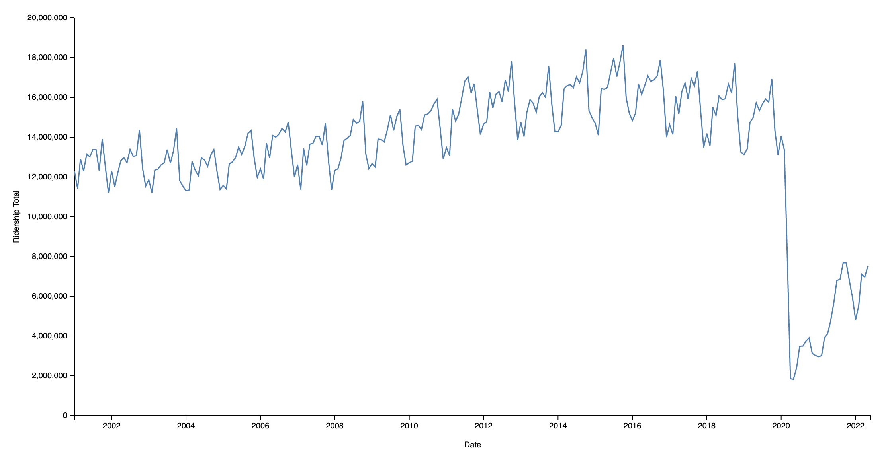
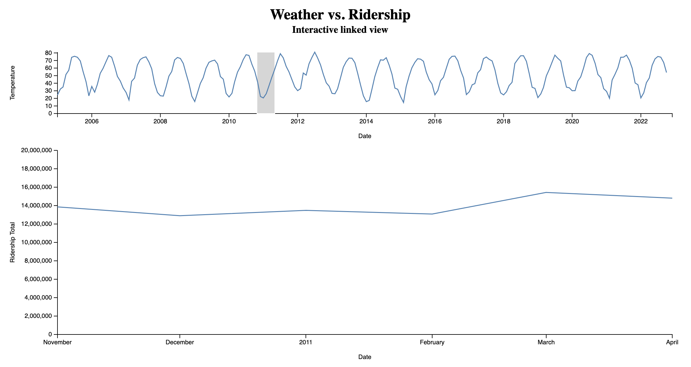
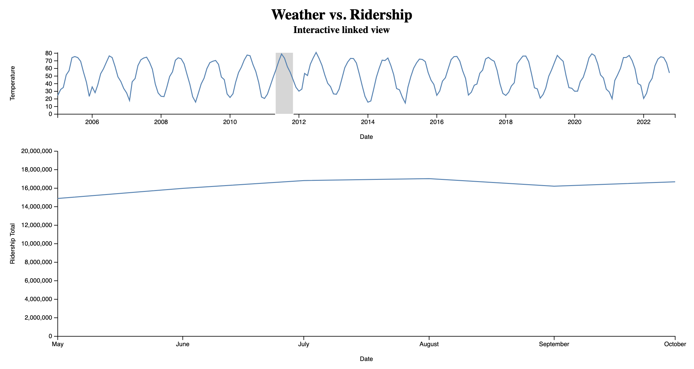
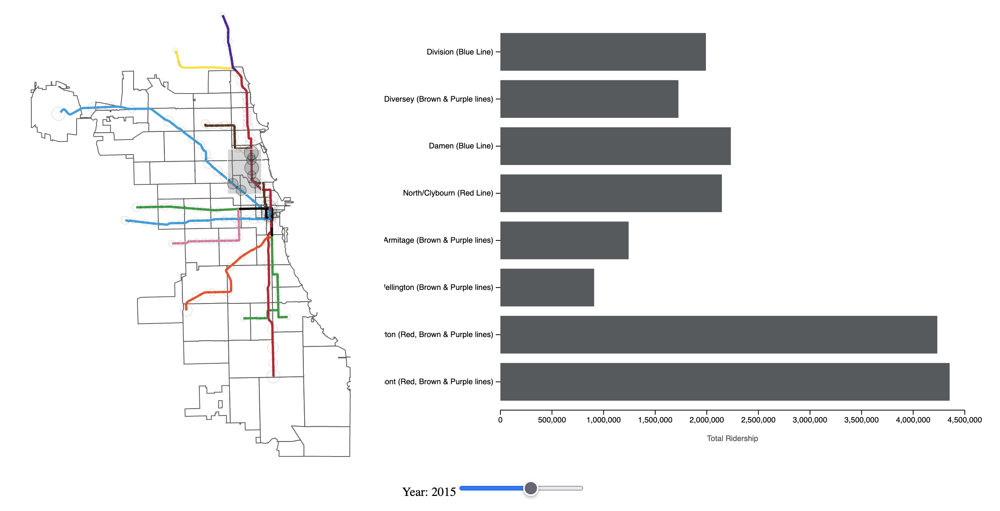
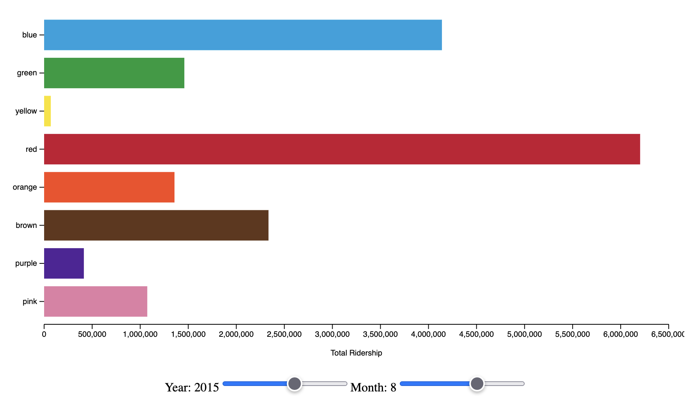

# Chicago 'L' Ridership Data

### CS 424: Project 3

### Adam Beigel and Logan Stein

### 2 December 2022

[Visualization Website](https://abeige.github.io/cs424-project3/site/index.html) (There's a lot of data- give it a minute to load.)

## The Data

We worked with CTA 'L' ridership data from the city of Chicago's data portal and wanted to analyze how ridership changed over time and with the weather.

### Ridership Data

The ridership data is spatiotemporal and contains the number of rides for each station and day since 2001. It has four columns:

1. `station_id`: integer, five-digit number assigned to each 'L' station
1. `date`: string, date the data was collected
1. `day_type`: character, W=Weekday, A=Saturday, or U=Sunday/Holiday
1. `rides`: integer, number of rides at the station on that date

### 'L' Station Data

Station information for all 'L' stations.

1. `station_id`: integer, five-digit number assigned to each 'L' station
1. `station_name`: string, full name of the station
1. `ada`: boolean, true if line is ADA accessible 
1. `line`: integer, several columns; if the station serves the line, ratio of rides to that line. null otherwise
1. `longitude`, `latitude`: float, location of the station

### Weather Data

We used monthly average temperatures going back to January 2001 from [weather.gov](https://www.weather.gov/wrh/Climate?wfo=lot) (Monthly Summarized Data, Variable -> Avg temp). It has three columns:

1. `year`: int, 4 digit year
1. `month`: string, 3 letter month
1. `avg_temp`: float, average temperature for the date in fahrenheit

## Processing

The ridership data did not need much processing, since it's really just the daily ridership information. The 'L' station data had some typos and formatting errors, so we fixed those and kept only the columns we needed.

Then we joined the ridership data with the 'L' station data using the common field `station_id`.

For the weather data, we converted the `year` and `month` fields into a single column, `date`, containing a Date object.

## Data Encoding

Across our visualizations, ridership is encoded as the size of an element. On the map, it will be the area of the circle. On the bar graph, it will be the length of the bar, and on a line graph it will be the y-position of the point.

In addition to ridership, we also have longitude, latitude, and the color of the 'L' line. We use a map to show the position of each station. When applicable, the official CTA colors are used for the line colors.

## Exploration

In order to visualize the data, we used the ZIP Code Boundaries and Rail Line Information datasets. Here you can see each of the 'L' stations plotted on top of these maps:

Another thing to note about the data is that the ridership total is for each *station*, and it is not broken down by line. In order to approximate the number of rides per *line*, we will make the assumption that the rides for a station are equally distributed across all the lines it services. This is not a super accurate number but it gets us close enough to see trends across the different lines.

As a brief statistical analysis of the data, we have a histogram of the frequency of daily ridership totals. We can see that most stations see a daily ridership of between 500 and 3500.

## Data Questions

We will answer 3 questions with our visualizations.

1. How did ridership change during the pandemic?
1. Does the weather affect ridership?
1. Where are the most popular stations by year?

### Question 1: How did ridership change during the pandemic?

This graph shows the aggregated monthly totals for all stations. We can see the huge drop in ridership in March of 2020 and ridership has not returned to pre-pandemic levels since then.

### Question 2: Does the weather affect ridership?

For this question, we will use an interactive visualization to compare ridership graphs for different periods of the year. This visualization shows just the ridership for the period of time the user selects, so in order to better make comparisons we fix the y-axis scale.

There is nothing too surprising here; there is higher ridership in warm months. This trend consistently appears every year.

### Question 3: Where are the most popular stations by year?

This is best shown in our interactive and linked map/bar chart view.

The map shows the ridership by the area of the circles, and we can get more detail on the stations by selecting some of them with a brush. This shows the relative ridership a bit better and with the actual numbers via the x-axis.

If we are more interested in line ridership rather than station, we also have a bar graph of ridership by line which can also be filtered by year.

